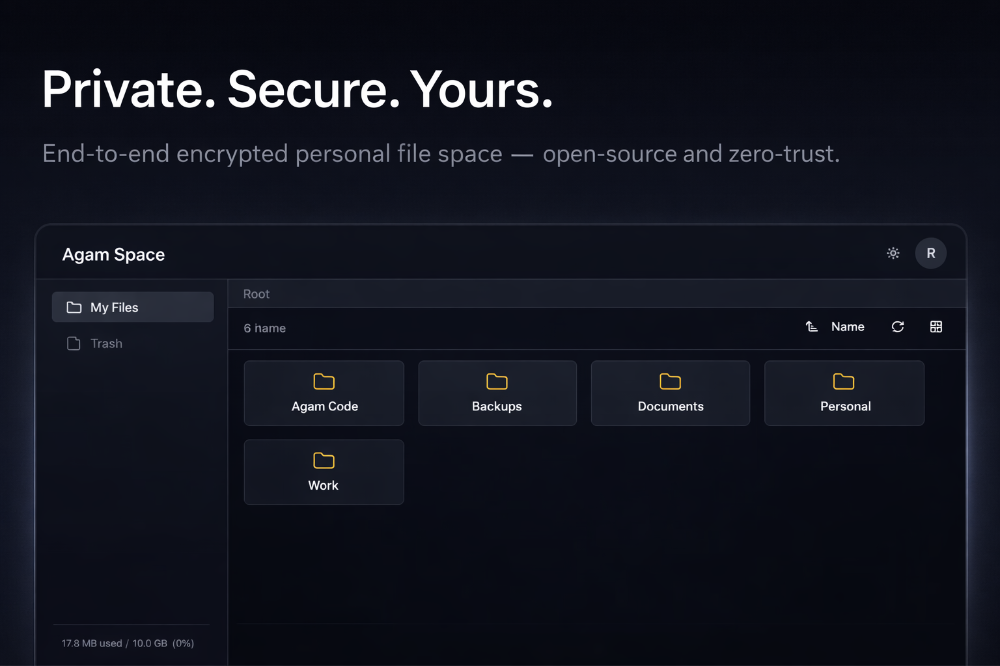
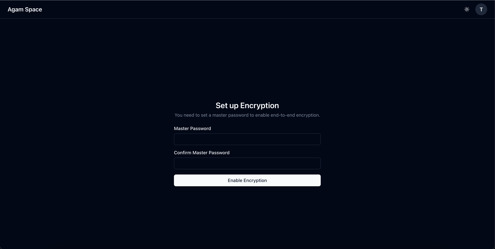
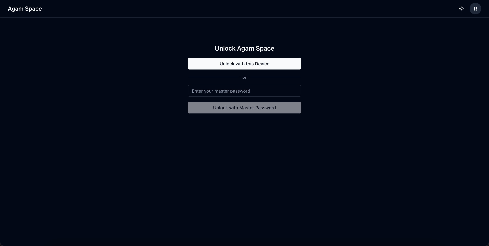
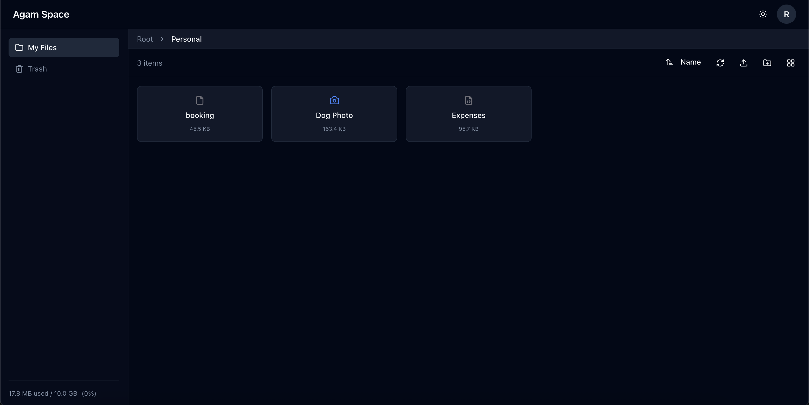
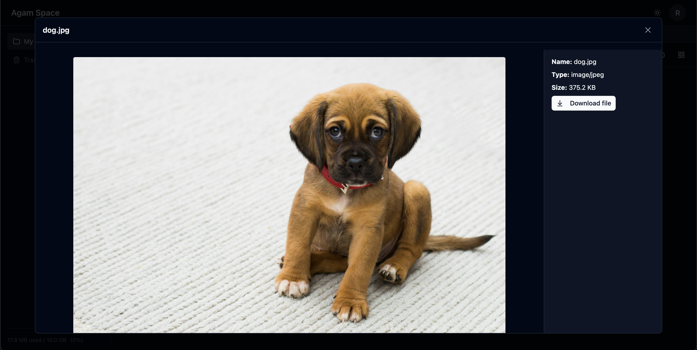

# Agam Space

> Self-hosted, end-to-end encrypted file storage platform

[](https://github.com/ramesh-lingappan/agam-space/actions/workflows/ci.yml)
[](https://hub.docker.com/r/agamspace/agam-space)
[](https://github.com/ramesh-lingappan/agam-space/releases)
[](./LICENSE)



End-to-end encrypted file storage you can self-host. All files and metadata
encrypted on your device before upload. Zero-knowledge architecture - the server
cannot access your files or encryption keys.

**About the name:** Agam (அகம்) is Tamil for "inner" or "heart" - fitting for a
platform where your data remains private.

## ⚠️ **BETA SOFTWARE - USE WITH CAUTION**

**Agam Space is in early beta and not ready for production use.**

- Bugs and data loss are possible
- Breaking changes may occur between versions
- **Do not use as your only backup**
- Keep copies of important files elsewhere
- Not professionally audited

Once stable, this warning will be removed.

---

## What it does

- Upload and organize files with end-to-end encryption
- Files encrypted in browser before upload (XChaCha20-Poly1305)
- Folder names and metadata also encrypted
- Biometric unlock on trusted devices (Touch ID, Face ID, Windows Hello)
- Web interface (desktop and mobile browsers)
- Self-hosted with Docker

## Why I Built This

After years of self-hosting, I got frustrated with E2EE options. Nextcloud's
implementation has gaps. Most solutions tell you to "just encrypt the disk" -
but that doesn't help if your server gets compromised or if you're the admin who
can access everything.

I wanted to share storage with family and friends without being able to read
their files. Ente Photos proved this works great for photos. I wanted the same
for general files.

With over a decade in software architecture and a strong interest in application
security, I wanted to build a proper E2EE app while having fun exploring modern
cryptographic patterns.

## Features

**Encryption:**

- Client-side encryption (zero-knowledge)
- Master password derives all keys
- Recovery key for backup
- Each file gets unique encryption key

**Authentication:**

- Email/password login
- Optional SSO (Authelia, Authentik, Keycloak, Google, GitHub)
- WebAuthn biometric unlock on trusted devices

**File Management:**

- Upload via drag-and-drop or file picker
- Folder organization
- File preview (PDF, images, text)
- Edit text files inline
- 30-day trash bin

**Storage:**

- Per-user quotas (default 10GB)
- Chunk-based uploads (resumable)
- Local filesystem storage

## Screenshots

<table>
  <tr>
    <td width="50%">
      
      <p align="center"><b>Master Password Setup</b></p>
    </td>
    <td width="50%">
      
      <p align="center"><b>Biometric Device Unlock</b></p>
    </td>
  </tr>
  <tr>
    <td width="50%">
      
      <p align="center"><b>File Explorer</b></p>
    </td>
    <td width="50%">
      
      <p align="center"><b>Image Preview</b></p>
    </td>
  </tr>
</table>

<details>
<summary>📸 More Screenshots</summary>

### Settings & Configuration


</details>

## Tech Stack

**Docker (Recommended):**

```bash
# Pull from Docker Hub
docker pull agamspace/agam-space:latest

# Or from GitHub Container Registry
docker pull ghcr.io/ramesh-lingappan/agam-space:latest
```

**Docker Compose:**

Install with Docker Compose:

```bash
mkdir agam-space && cd agam-space

# Create docker-compose.yml (see docs for full config)
curl -o docker-compose.yml https://raw.githubusercontent.com/ramesh-lingappan/agam-space/main/apps/api-server/docker-compose.yaml

# Start containers
docker-compose up -d
```

Access at http://localhost:3331

For production setup with HTTPS, see
[Installation Guide](./docs/docs/installation/docker-compose.md).

## Tech Stack

**Backend:**

- NestJS + Fastify
- PostgreSQL + Drizzle ORM
- Local file storage

**Frontend:**

- Next.js 15 + React
- Tailwind CSS
- Zustand (state)

**Crypto:**

- Web Crypto API
- Libsodium (WASM)
- WebAuthn

**Deployment:**

- Docker + Docker Compose
- All-in-one container (API + Web)

## Project Structure

```
agam-space/
├── apps/
│   ├── api-server/    # NestJS backend
│   ├── web/           # Next.js frontend
├── packages/
│   ├── client/        # API client + E2EE logic
│   ├── core/          # Cryptography primitives
│   └── shared-types/  # TypeScript types
└── docs/              # Documentation (Docusaurus)
```

## Development

```bash
# Prerequisites: Node.js 22, pnpm 9

# Install dependencies
pnpm install

# Start all apps
pnpm dev

# Or start individually
pnpm dev:api    # API server (port 3001)
pnpm dev:web    # Web UI (port 3000)
pnpm dev:docs   # Documentation (port 3002)

# Build everything
pnpm build

# Run tests
pnpm test

# Lint and format
pnpm lint
pnpm format
```

## Documentation

- [Installation](./docs/docs/installation/docker-compose.md) - Docker setup
- [Configuration](./docs/docs/configuration/index.md) - SSO, quotas, users
- [Security](./docs/docs/security.md) - How encryption works
- [Architecture](./docs/docs/architecture.md) - Technical details
- [FAQ](./docs/docs/faq.md) - Common questions

## Security

**How it works:**

1. Master password derives Cryptographic Master Key (CMK)
2. CMK encrypts folder keys
3. Folder keys encrypt file keys
4. File keys encrypt file chunks
5. Everything encrypted before upload

**Server sees:**

- Encrypted binary blobs
- File sizes and timestamps
- Folder structure (but not names)

**Server cannot see:**

- File contents
- File names
- Folder names
- Master password or encryption keys

**Not audited** - Personal project for learning. Use at your own risk.

## Roadmap

See [planned features](./docs/docs/features.md#planned-features) in
documentation.

Priority features:

- File sharing between users
- Desktop sync client
- S3 backend support
- File versioning
- Mobile apps

No timeline - built when I have time.

## CI/CD

Automated workflows:

- **CI**: Lint, test, build on PRs to main
- **Docker**: Build and publish on git tags
- **Security**: CodeQL + Trivy scanning
- **Docs**: GitHub Pages deployment (manual trigger)

## Contributing

This is a personal project but contributions welcome. Open an issue first to
discuss changes.

## License

[GNU AGPLv3](./LICENSE)
