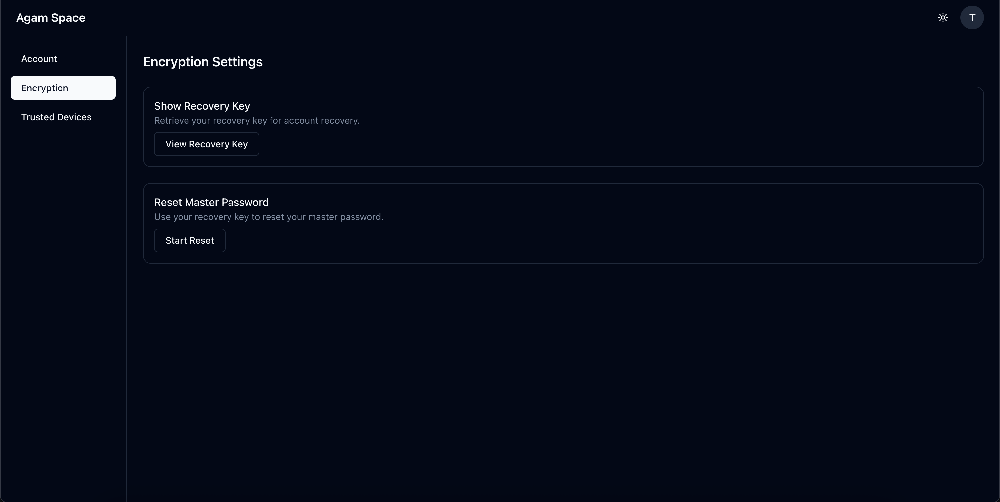

# Agam Space

> Self-hosted, **zero-knowledge**, end-to-end encrypted file storage

[](https://github.com/agam-space/agam-space/actions/workflows/ci.yml)
[](https://hub.docker.com/r/agamspace/agam-space)
[](https://github.com/agam-space/agam-space/releases)
[](./LICENSE)


**True zero-knowledge encryption for self-hosted file storage.**

All files and metadata encrypted in your browser before upload. Your master
password never leaves your device. The server stores only encrypted blobs and
cannot decrypt your data - even the server admin cannot access your files.

Think of it as a self-hosted alternative to Mega or Proton Drive, where privacy
is guaranteed by cryptography, not trust.

**About the name:** Agam (அகம்) comes from Tamil language and refers to the
inner, personal world, distinct from what is public. It reflects our commitment
to keeping your data private and encrypted.

## ⚠️ **BETA SOFTWARE - USE WITH CAUTION**

**Agam Space is in early beta and not ready for production use.**

- Bugs and data loss are possible
- Breaking changes may occur between versions
- **Do not use as your only backup**
- Keep copies of important files elsewhere
- Not professionally audited

Once stable, this warning will be removed.

---

## What it does

- Upload and organize files with end-to-end encryption
- Files encrypted in browser before upload (XChaCha20-Poly1305)
- Folder names and metadata also encrypted
- Biometric unlock on trusted devices (Touch ID, Face ID, Windows Hello)
- Web interface (desktop and mobile browsers)
- Self-hosted with Docker

## Documentation

📚 **Full documentation: [docs.agamspace.app](https://docs.agamspace.app)**

Quick links:

- [Installation](https://docs.agamspace.app/installation/docker-compose) -
  Docker setup
- [Configuration](https://docs.agamspace.app/configuration/) - SSO, quotas,
  users
- [Security](https://docs.agamspace.app/security) - How encryption works
- [Architecture](https://docs.agamspace.app/architecture) - Technical details
- [FAQ](https://docs.agamspace.app/faq) - Common questions

## Why I Built This

For a while now, I've wanted to offer file storage to family and friends on my
homelab. But I was always hesitant - I didn't want the ability to access their
files. Even if I wouldn't look, the fact that I _could_ bothered me. They knew
it too, which made them hesitant to use it.

Looking at self-hosted options, true E2EE is surprisingly limited. Nextcloud has
E2EE but with known gaps. Most solutions rely on disk encryption, which only
protects against physical theft - not server compromise or admin access.

Agam Space solves this with proper zero-knowledge encryption - where
cryptography guarantees privacy, not trust. The server admin literally cannot
access your files, even if they wanted to.

## Features

- Zero-knowledge end-to-end encryption (XChaCha20-Poly1305)
- WebAuthn biometric unlock (Touch ID, Face ID, Windows Hello)
- File upload and management
- File previews (PDF, images, text)
- SSO support (Authelia, Authentik, Keycloak, PocketID)
- Per-user storage quotas
- 30-day trash bin

**See [Features](https://docs.agamspace.app/features) for complete list.**

## Screenshots

<table>
  <tr>
    <td width="50%">
      
      <p align="center"><b>Master Password Setup</b></p>
    </td>
    <td width="50%">
      
      <p align="center"><b>Biometric Device Unlock</b></p>
    </td>
  </tr>
  <tr>
    <td width="50%">
      
      <p align="center"><b>File Explorer</b></p>
    </td>
    <td width="50%">
      
      <p align="center"><b>Image Preview</b></p>
    </td>
  </tr>
</table>

<details>
<summary>📸 More Screenshots</summary>

### Settings & Configuration



</details>

## Quick Start

**Docker Compose (Recommended):**

```bash
# Pull the image
docker pull agamspace/agam-space:latest

# Get docker-compose.yml
curl -o docker-compose.yml https://raw.githubusercontent.com/agam-space/agam-space/main/apps/api-server/docker-compose.yaml

# Start containers
docker-compose up -d
```

Access at http://localhost:3331

**For production setup with HTTPS, reverse proxy, and more:**  
👉 [Installation Guide](https://docs.agamspace.app/installation/docker-compose)

## Tech Stack

**Backend:**

- NestJS + Fastify
- PostgreSQL + Drizzle ORM
- Local file storage

**Frontend:**

- Next.js 15 + React
- Tailwind CSS
- Zustand (state)

**Crypto:**

- Web Crypto API
- Libsodium (WASM)
- WebAuthn

**Deployment:**

- Docker + Docker Compose
- All-in-one container (API + Web)

## Project Structure

```
agam-space/
├── apps/
│   ├── api-server/    # NestJS backend
│   ├── web/           # Next.js frontend
├── packages/
│   ├── client/        # API client + E2EE logic
│   ├── core/          # Cryptography primitives
│   └── shared-types/  # TypeScript types
└── docs/              # Documentation (Docusaurus)
```

## Development

```bash
# Prerequisites: Node.js 22, pnpm 9

# Install dependencies
pnpm install

# Start all apps
pnpm dev

# Or start individually
pnpm dev:api    # API server (port 3001)
pnpm dev:web    # Web UI (port 3000)
pnpm dev:docs   # Documentation (port 3002)

# Build everything
pnpm build

# Run tests
pnpm test

# Lint and format
pnpm lint
pnpm format
```

## Security

All encryption happens client-side in your browser. The server stores only
encrypted blobs and cannot decrypt your data.

**Read the full security model:**
[Security Documentation](https://docs.agamspace.app/security)

**Not professionally audited** - Use at your own risk.

## Roadmap

**Current focus:** Bug fixes & improvements

Possible features under consideration:

- File sharing between users
- Public links with expiry
- S3 backend support
- Encrypted tags and search

**See [Roadmap](https://docs.agamspace.app/features/roadmap) for details.**

## CI/CD

Automated workflows:

- **CI**: Lint, test, build on PRs to main
- **Docker**: Build and publish on git tags
- **Security**: CodeQL + Trivy scanning
- **Docs**: GitHub Pages deployment (manual trigger)

## Contributing

This is a personal project but contributions welcome. Open an issue first to
discuss changes.

## License

[GNU AGPLv3](./LICENSE)
