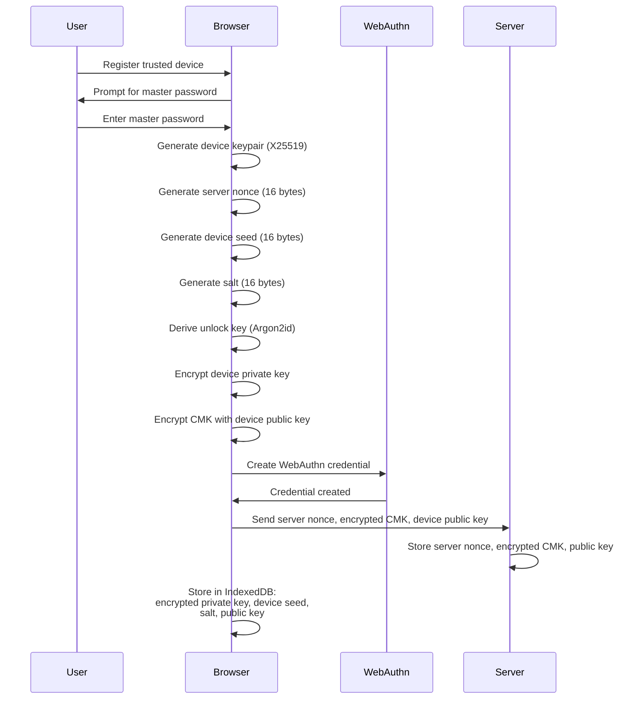
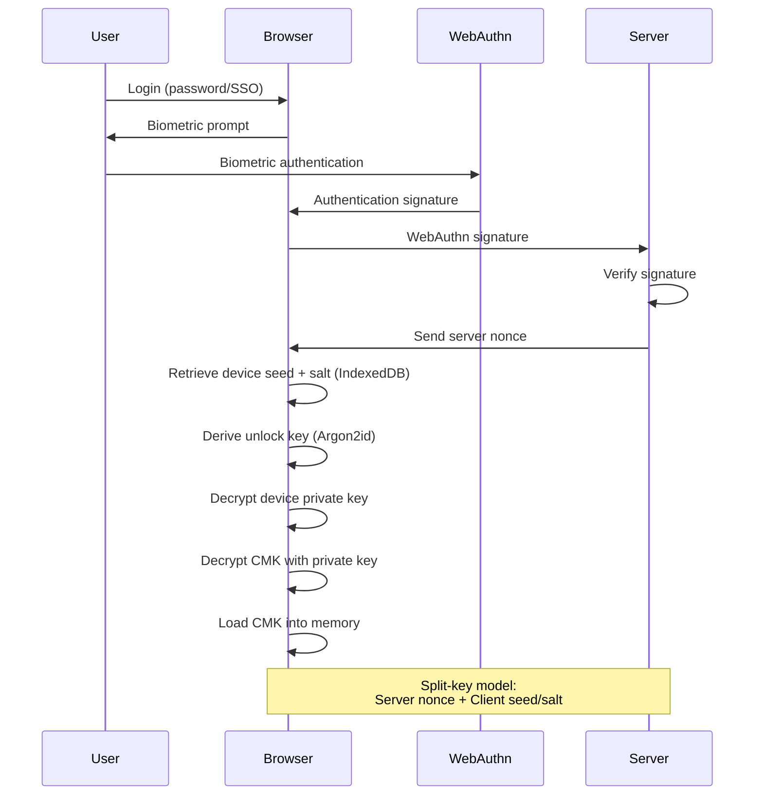
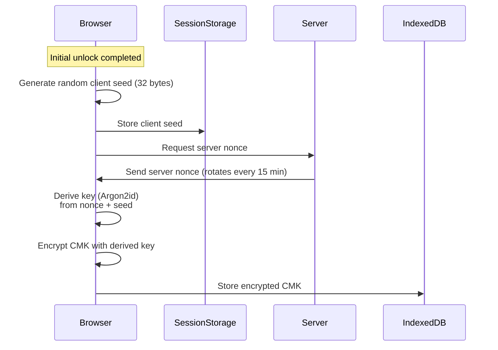
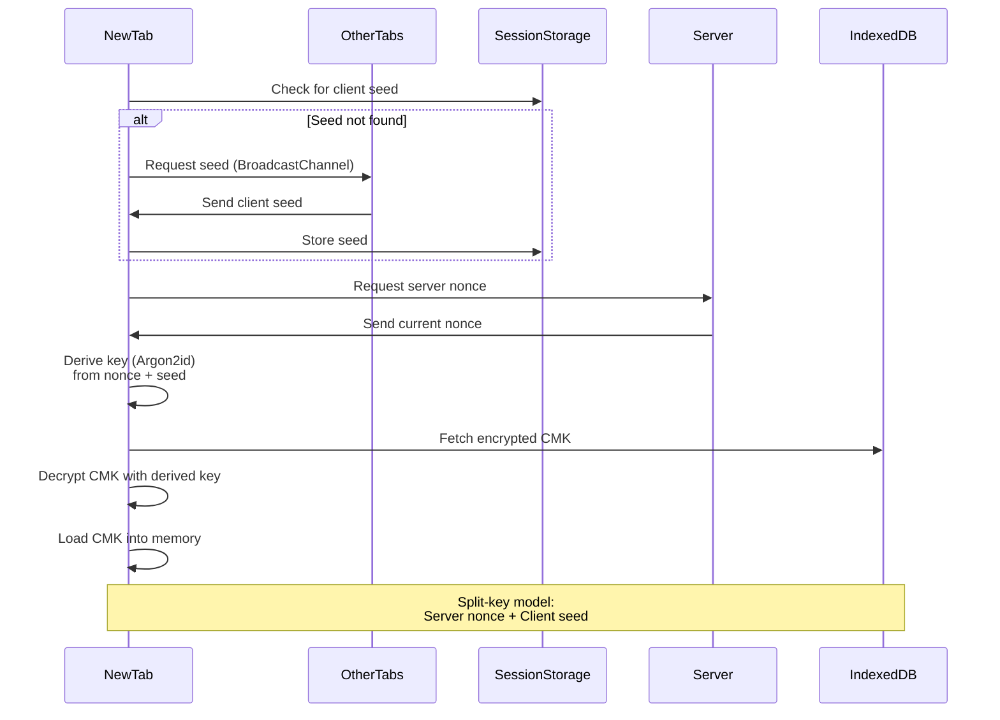

# Unlocking Master Key

How to unlock your Cryptographic Master Key (CMK) to access encrypted data.

## Overview

After logging in, your CMK must be unlocked to decrypt files. The CMK is always
encrypted at rest - you need to unlock it to load it into browser memory.

**Important: Your CMK is never stored in plaintext anywhere.** It only exists
unencrypted in browser memory during an active session. All persistence (server
database, browser storage) contains only encrypted forms of the CMK.

**Three methods available, each with different convenience vs security
trade-offs:**

## 1. Master Password (Default)

Enter your master password every time to unlock the CMK.

**When you'll need to enter it:**

- First time after login
- Every page reload or new tab (unless auto-unlock is enabled)
- After 15 minutes if auto-unlock is enabled (when server nonce rotates)

**How it works:**

1. Browser prompts for master password
2. Argon2id derives key from password (client-side)
3. Derived key decrypts CMK
4. CMK loaded into memory

**Security:** Most secure option. Master password never stored anywhere, only
used to derive decryption keys in browser memory. The derived key is discarded
immediately after decrypting the CMK. The downside is needing constant access to
your master password.

## 2. Trusted Device Unlock (WebAuthn)

Use biometric authentication instead of typing your master password.

**Why this exists:**

Needing constant access to your master password is inconvenient:

- Password managers can't auto-fill master passwords (by design)
- On mobile devices, retrieving and typing passwords is tedious
- Frequent interruptions break workflow

Trusted devices solve this by using biometric authentication (Touch ID, Face ID,
Windows Hello) that's quick and doesn't require accessing your password manager.

**Requirements:**

- Register device once with master password
- HTTPS required (WebAuthn security requirement)
- Device with biometric hardware

**How it works:**

**Registration (one-time):**



**Subsequent logins:**



**Registration (one-time):**

1. Client generates device keypair (X25519 public/private keys)
2. Client generates random PRF input (32 bytes)
3. Client generates random server nonce (16 bytes)
4. WebAuthn credential created with PRF extension (if supported)
5. If PRF not supported, client generates random device seed (16 bytes)
6. Client generates random salt (16 bytes)
7. Unlock key derived using Argon2id from: server nonce + (PRF output or device
   seed) + salt
8. Device private key encrypted with derived unlock key
9. CMK encrypted with device public key
10. **Server stores:** Server nonce, encrypted CMK, device public key
11. **Client stores in IndexedDB:** Encrypted device private key, salt, device
    public key (device seed only if PRF not supported)

**Subsequent logins:**

1. Enter login credentials (password or SSO)
2. Biometric prompt (Touch ID, Face ID, fingerprint)
3. WebAuthn creates authentication signature
4. If PRF supported, WebAuthn derives key using stored PRF input (embedded in
   credential)
5. Server verifies WebAuthn signature
6. Server sends server nonce (only after successful verification)
7. Client retrieves salt from IndexedDB (and device seed if PRF not used)
8. Unlock key derived using Argon2id from: server nonce + (PRF output or device
   seed) + salt
9. Derived unlock key decrypts device private key
10. Device private key decrypts CMK
11. CMK loaded into memory

**PRF Extension:**

Browsers with WebAuthn PRF (Pseudo-Random Function) support derive a
cryptographic key directly from the device's secure hardware. This provides
stronger security than a client-generated seed:

- Key derived from device secure element (TPM, Secure Enclave)
- Cannot be extracted or cloned without physical device access
- Bound to the specific WebAuthn credential

Browsers without PRF support use a randomly generated device seed stored in
IndexedDB instead.

**Security - Split-Key Model:**

Uses a split-key approach where the **derived unlock key** is never persisted -
it's computed on-demand from three stored components. Neither server breach nor
client storage theft alone can decrypt the CMK:

**Server stores:**

- Server nonce (16 bytes, stored in database as `unlockKey`)
- Encrypted CMK
- Device public key

**Client stores (IndexedDB, persisted by default):**

- Encrypted device private key
- Device seed (16 bytes, only if PRF not supported)
- Salt (16 bytes)
- Device public key

**Note:** Client data persists across logouts by default. This allows biometric
unlock without re-registration after logout. Users can enable "Clear on logout"
in Settings → Trusted Devices to remove local data on logout.

**Unlock key derivation:**

```
With PRF support:
unlockKey = Argon2id(serverNonce + PRF(deviceSecureElement), salt)

Without PRF:
unlockKey = Argon2id(serverNonce + deviceSeed, salt)
```

**What this prevents:**

- **Server breach alone:** Attacker gets server nonce but cannot derive unlock
  key without device hardware (PRF) or client-stored seed/salt
- **Client storage theft alone:** Attacker gets device seed, salt, and encrypted
  device private key but cannot derive unlock key without server nonce (requires
  WebAuthn authentication)
- **Compromised session:** Cannot retrieve server nonce without WebAuthn proof
  from device secure hardware
- **Device cloning (with PRF):** PRF output bound to device secure element,
  cannot be extracted

**Requirements for successful unlock:**

1. Valid login session
2. WebAuthn authentication (biometric or hardware key)
3. Server nonce (released only after WebAuthn proof)
4. PRF-derived key (if supported) or device seed + salt from client IndexedDB
5. Derive unlock key using Argon2id
6. Decrypt device private key
7. Decrypt CMK with device private key

**Device Registration:**

- One trusted device per browser instance
- Each device has unique server nonce, PRF input (or device seed), and salt
- Multiple browsers/devices can be registered (e.g., laptop + phone + tablet)
- Removing a device from the server requires manual cleanup of IndexedDB if
  "Clear on logout" is disabled

## 3. Auto-unlock on Page Reload (Optional)

Skip re-entering your master password when reloading or opening new tabs.
(Disabled by default). You must explicitly enable this in Settings → Encryption
→ "Auto-unlock on page reload"

**Why this exists:**

Even with trusted devices, biometric prompts on every page reload can feel
excessive. This feature lets you unlock once, then stays unlocked across all
tabs until you logout or after every 15 minutes when the server nonce rotates.

**How it works:**

After you unlock (with master password or trusted device):



**On page reload or new tab:**



After you unlock (with master password or trusted device):

1. Client generates random seed (32 bytes, stored in sessionStorage)
2. Server issues random nonce (32 bytes, unique per login session, rotates every
   15 minutes)
3. Encryption key derived from server nonce + client seed using Argon2id
4. CMK encrypted using XChaCha20-Poly1305 with derived key
5. Encrypted CMK stored in IndexedDB

**On page reload or new tab:**

1. Client checks sessionStorage for seed
   - If found: proceeds to step 4
   - If not found: requests seed from other tabs via BroadcastChannel
2. Other tabs respond with their seed (if they have one)
3. Seed stored in sessionStorage for this tab
4. Client requests server nonce (strict server-side validation)
5. Derives decryption key from nonce + seed
6. Decrypts CMK from IndexedDB
7. CMK loaded into memory

**Cross-tab sync:**

When you open a new tab, the browser uses BroadcastChannel to request the client
seed from existing tabs. This allows seamless auto-unlock across all tabs
without re-authentication, as long as the 15-minute window hasn't expired.

**Security model:**

Split-key approach where **both** server and client components are required:

- **Server:** Random nonce (unique per session, server rotates every 15 minutes)
- **Client:** Random seed in sessionStorage (cleared on tab close, shared via
  BroadcastChannel)
- **IndexedDB:** Encrypted CMK

**Why 15-minute rotation:**

Server nonce automatically rotates every 15 minutes regardless of activity. When
the nonce rotates, the old encrypted CMK becomes undecryptable, and you must
unlock again with your master password or trusted device. Your login session
remains active - you'll just need to unlock again.

**What this protects against:**

- **Stolen browser profile:** Encrypted CMK useless without server nonce
  (requires valid session) and client seed (cleared on browser close)
- **Time-limited exposure:** Server nonce rotates every 15 minutes
- **Session hijacking:** Session cookie is HttpOnly (JavaScript cannot read it),
  preventing client-side session theft
- **Cross-origin attacks:** BroadcastChannel is origin-scoped (only same-origin
  tabs can communicate)

**What this does NOT protect against:**

- **XSS attacks:** Malicious JavaScript can access sessionStorage (client seed),
  make API calls to get server nonce, then decrypt CMK from IndexedDB
- **Browser extensions with permissions:** Can access sessionStorage, IndexedDB,
  and make API requests to obtain server nonce

**When auto-unlock expires:**

You'll be prompted to unlock manually (no data loss) when:

- Server nonce rotates (every 15 minutes - login session remains active)
- Browser closed (all sessionStorage cleared)
- Logout (all data wiped, broadcasted to all tabs)
- Session revoked on server

**Logout sync:**

When you logout in one tab, all other tabs are automatically logged out via
BroadcastChannel. This ensures consistent state across all tabs and prevents
orphaned sessions.

**Security vs convenience:**

This is a session-bound convenience feature that relies on the browser
environment being trusted (no XSS, no malicious extensions).

If your threat model requires maximum security, keep this disabled and use
master password or trusted device unlock on every page load.

## Two-Layer Protection

Regardless of which unlock method you use, accessing your encrypted files
requires **both**:

- **Valid login session** - to make authenticated API requests to download
  encrypted files
- **Unlocked CMK in memory** - to decrypt the downloaded files

CMK alone is useless without server access. Login session alone cannot decrypt
files. Both are required.

## Further Reading

- [Recovery](./recovery.md) - Recovery key usage
- [Encryption](./encryption.md) - How CMK encrypts data
