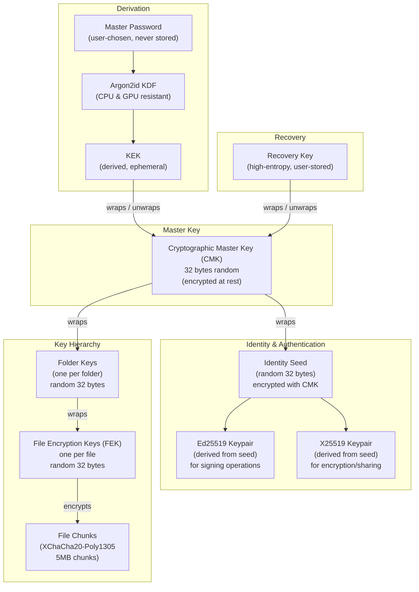
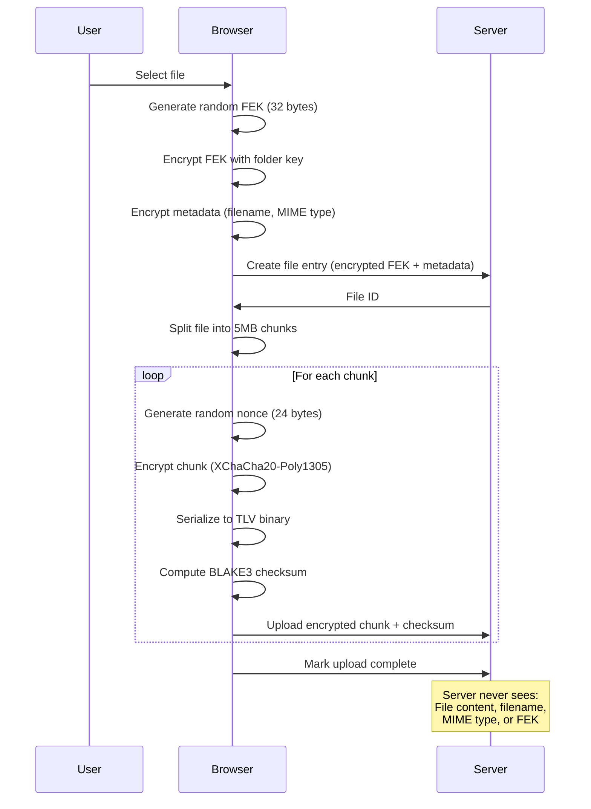
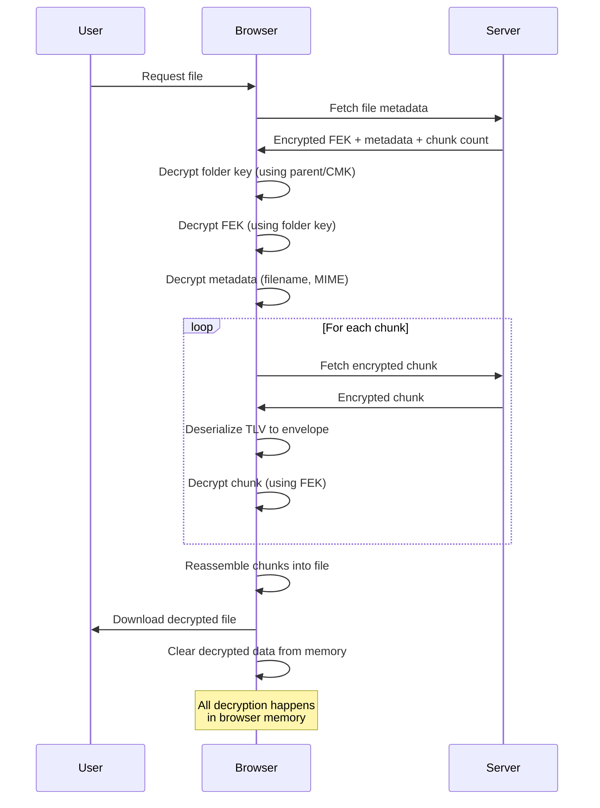

# Encryption

How Agam Space encrypts your data using zero-knowledge, end-to-end encryption.

## Zero-Knowledge Encryption

**Zero-knowledge** means the server cannot decrypt your data under any
circumstances.

**Why it matters:**

- Server compromise → Your data stays encrypted
- Database leak → Only encrypted blobs exposed
- Malicious admin → Cannot read your files
- Stolen backups → Still encrypted

**The trade-off:**

Lose your master password AND recovery key → Data is permanently unrecoverable.
No password reset, no admin recovery. This is by design.

## Cryptographic Primitives

All cryptography uses industry-standard, battle-tested algorithms. No custom
crypto.

### Key Derivation

**Algorithm:** Argon2id (via libsodium)

- **opslimit:** 3 (number of passes over memory)
- **memlimit:** 65536 KB (64 MB of memory)
- **Output:** 32 bytes (256 bits)

### Device Keys

**Algorithm:** X25519 (Curve25519 ECDH)

- **Key size:** 256 bits (32 bytes)
- **Purpose:** Device unlock key agreement

### File Encryption

**Algorithm:** XChaCha20-Poly1305 (AEAD cipher)

- **Cipher:** XChaCha20 (stream cipher)
- **Authentication:** Poly1305 (MAC)
- **Nonce:** 192 bits (24 bytes)
- **Key size:** 256 bits (32 bytes)

### Hashing

**BLAKE3:**

- **Output:** Variable (default 256 bits)
- **Purpose:** File chunk checksums

**SHA-256:**

- **Output:** 256 bits
- **Purpose:** Legacy compatibility

## Key Hierarchy

Your master password is the root of trust. All encryption keys derive from it.



### Master Password

- **Input:** User-chosen passphrase
- **Storage:** Never stored anywhere (client or server)
- **Usage:** Derives CMK via Argon2id when needed

### Cryptographic Master Key (CMK)

**Generation:** Random 32 bytes (256 bits)

**Storage:**

- **Client-side:** In browser memory during session (cleared on logout)
- **Client-side (Optional):** Encrypted in IndexedDB for auto-unlock (if enabled
  in settings)
- **Server-side:** Encrypted with password-derived key (server cannot decrypt)

**Encrypted storage format:**

```
Password → Argon2id → Derived Key (256 bits)
Derived Key → XChaCha20-Poly1305 → Encrypted CMK
```

**Auto-unlock storage (optional):**

```
Server Nonce + Client Seed → Argon2id → Derived Key (256 bits)
Derived Key → XChaCha20-Poly1305 → Encrypted CMK (stored in IndexedDB)
```

See [Auto-unlock](./cmk-unlock#3-auto-unlock-on-page-reload-optional) for
details.

Server stores only encrypted CMK. Without master password, cannot derive key to
decrypt CMK.

### Recovery Key

High-entropy backup key to restore CMK access if master password is forgotten.

**Generation:** Random 32 bytes (256 bits), Base58 encoded

**Storage:**

- **Client-side:** Displayed once during setup (user must save offline). Can be
  retrieved later from settings by unlocking with master password.
- **Server-side:** Two encrypted copies:
  - CMK encrypted with Recovery Key (enables recovery)
  - Recovery Key encrypted with CMK (enables retrieval from settings)

**Encryption format:**

```
Recovery Key → XChaCha20-Poly1305 → Encrypted CMK
CMK → XChaCha20-Poly1305 → Encrypted Recovery Key
```

**Usage:** Alternative CMK unlock without Argon2id derivation. Store securely
offline (password manager or printed). Losing both master password and recovery
key means permanent data loss.

### Identity Keys

User identity is represented by two derived keypairs for different purposes:

**Identity Seed:**

- Random 32 bytes (256 bits) generated during setup
- Encrypted with CMK for storage
- Never sent to server

**Derivation:**

From the identity seed, two independent keypairs are derived using HKDF:

1. **Ed25519 Keypair (signKey)** - for signing critical operations
   - HKDF(seed, "ed25519-key-context") → Ed25519 seed
   - Private key: 64 bytes
   - Public key: 32 bytes

2. **X25519 Keypair (encKey)** - for encryption and future sharing features
   - HKDF(seed, "x25519-key-context") → X25519 seed
   - Private key: 32 bytes
   - Public key: 32 bytes

**Usage:**

- Sign challenge during password reset to prove ownership
- Sign critical operations
- X25519 key for encrypting shared data (future)

**Benefits:**

- Random seed independent from CMK
- Both keys derived deterministically from same seed
- CMK rotation doesn't affect identity
- Can safely rotate CMK without changing identity

```
CMK → BLAKE3 ("agam-space-identity-key-v1") → Ed25519 seed → Keypair
```

**Storage:**

- **Public key:** 32 bytes, stored on server (base64)
- **Private key:** 32 bytes, derived on-demand from CMK (never stored)
- Deterministic: Same CMK always produces same keypair

**Usage:** Proves CMK possession for critical operations (changing master
password, etc). Client signs payload + timestamp with private key. Server
verifies using public key. Time-bound challenges prevent replay attacks.

### Folder Keys

Each folder gets a random 32-byte encryption key.

**Root folder:** Folder key encrypted with CMK

**Nested folders:** Folder key encrypted with parent folder key

**Benefits:**

- Each folder independent
- Folder sharing (future): Share folder key without exposing CMK or parent keys
- Key isolation: Compromising one folder key doesn't expose others

### File Encryption Keys (FEK)

Each file gets a random 256-bit key, encrypted with its folder key.

**Why random keys:**

- Each file independent
- No key reuse across files
- Each chunk gets a fresh random nonce (XChaCha20 uses 192-bit).

### Public Share Encryption

When you create a public share, the system generates split keys to encrypt the
file or folder key for external recipients.

**Key generation:**

1. Client generates `clientKey` (32 bytes random)
2. Client generates `serverShareKey` (32 bytes random)
3. Client generates `salt` (16 bytes random)

**Key derivation:**

```
wrapKey = Argon2id(clientKey + serverShareKey + password?, salt)
```

**Password is optional.** If provided, it adds an extra encryption layer.

**Key wrapping:**

```
wrappedItemKey = XChaCha20-Poly1305.encrypt(fileKey_or_folderKey, wrapKey)
```

**Distribution:**

- **Server stores:** `serverShareKey`, `wrappedItemKey`, `salt`, `passwordHash?`
- **URL contains:** `clientKey` (in #fragment, never sent to server)
- **User stores:** Nothing (one-time display)

**Decryption (by recipient):**

1. Recipient opens URL with `clientKey` in fragment
2. If password-protected, enters password
3. Server returns `serverShareKey`, `wrappedItemKey`, `salt`
4. Browser derives:
   `wrapKey = Argon2id(clientKey + serverShareKey + password?, salt)`
5. Browser unwraps:
   `itemKey = XChaCha20-Poly1305.decrypt(wrappedItemKey, wrapKey)`
6. Browser uses `itemKey` to decrypt file/folder content

**Security properties:**

- Server alone cannot decrypt (missing `clientKey`)
- URL alone cannot decrypt (missing `serverShareKey`)
- Both required to derive `wrapKey`
- Password adds additional layer (must know password to derive correct
  `wrapKey`)

See [Public Sharing Security](./public-sharing.md) for full details.

## Encryption Process

### File Upload



**Step-by-step:**

1. **Generate file encryption key (FEK):**
   - Random 32-byte key

2. **Split file into 5MB chunks**

3. **Encrypt each chunk:**
   - Generate random 24-byte nonce
   - Encrypt chunk with XChaCha20-Poly1305 (using FEK + nonce)
   - Serialize encrypted envelope to TLV binary format
   - Compute BLAKE3 checksum of TLV-encoded chunk
   - Upload TLV-encoded chunk and checksum

   **Note:** File chunks use raw TLV (Type-Length-Value) binary encoding for
   efficiency. Metadata uses base64-encoded TLV for JSON transport. Each chunk
   is checksummed (BLAKE3) and verified on upload for integrity.

4. **Compute file-level checksum:**
   - BLAKE3 hash of concatenated chunk checksums
   - Provides integrity verification for the entire file

5. **Encrypt FEK with folder key:**
   - Encrypt FEK using folder key

6. **Encrypt metadata:**
   - Encrypt filename with folder key
   - Encrypt MIME type with folder key

7. **Upload to server:**
   - Encrypted chunks (TLV binary)
   - Checksums (BLAKE3, one per chunk)
   - File checksum (BLAKE3, derived from chunk checksums)
   - Encrypted FEK (base64-encoded TLV)
   - Encrypted metadata (base64-encoded TLV)
   - File size (plaintext)
   - Chunk count (plaintext)

**Server never sees:** File content, filename, MIME type, or FEK in plaintext.

### File Download



**Step-by-step:**

1. **Fetch encrypted data from server:**
   - Encrypted chunks
   - Encrypted FEK
   - Encrypted metadata

2. **Decrypt folder key:**
   - Decrypt encrypted folder key using parent folder key (or CMK for root)

3. **Decrypt FEK:**
   - Decrypt FEK using folder key

4. **Decrypt each chunk:**
   - Deserialize TLV binary format to encrypted envelope
   - Decrypt envelope using FEK

5. **Reassemble file:**
   - Concatenate all decrypted chunks

6. **Cleanup:**
   - Decrypted data in memory only
   - Cleared after use

**All decryption happens in browser.** Server never sees plaintext.

## What Gets Encrypted

### Encrypted Data

**File contents:**

- Every byte of file data
- Split into 5MB chunks
- Each chunk individually encrypted

**File metadata:**

- File names
- Folder names
- MIME types
- Created/modified timestamps (client-side)
- Custom tags (future feature)

**Encryption keys:**

- File encryption keys (FEK)
- Folder keys (when stored)
- Recovery key (when stored server-side)

### Plaintext Data (Server-Visible)

**Required for functionality:**

- **File sizes** - Quota enforcement
- **Chunk counts** - Download coordination
- **Upload timestamps** - Server-side tracking
- **File IDs** - Random ULID
- **Folder IDs** - Random ULID

**User data:**

- Email addresses (authentication)
- Login password hash (Argon2id)
- User ID (ULID)

## Encrypted Envelope Format

All encrypted data uses a consistent envelope format with TLV
(Type-Length-Value) encoding:

```typescript
{
  v: number,           // Version (1 byte)
  n: Uint8Array,       // Nonce (24 bytes for XChaCha20)
  c: Uint8Array        // Ciphertext (variable length, includes Poly1305 tag)
}
```

### TLV Structure

Each field is encoded as Type-Length-Value:

```
┌──────────┬──────────────────┬────────────────┐
│   Type   │     Length       │     Value      │
│  1 byte  │  4 bytes (BE)    │   N bytes      │
└──────────┴──────────────────┴────────────────┘
```

**Type codes:**

- `0x01` = version
- `0x02` = nonce
- `0x03` = ciphertext

**Length:** 4 bytes, indicates size of value field

**Value:** Variable-length data

**Why TLV:**

- Self-describing format (no fixed positions)
- Forward compatible (can skip unknown types)
- Efficient binary encoding
- No delimiters or escaping needed

**Base64 encoding for storage/transmission** (for metadata/keys only, not file
chunks).

**Note:** XChaCha20-Poly1305 includes the 16-byte Poly1305 authentication tag at
the end of the ciphertext automatically. The envelope does not store it
separately.

## Limitations

**Be aware:**

- CMK compromise → All data decryptable
- Master password brute-force → Possible if weak password
- Client-side malware → Can steal keys from memory
- No plausible deniability (encrypted data obviously encrypted)
- No protection after decryption (screencast, screenshots)

## Further Reading

- [Authentication](./authentication.md) - Login and session security
- [Unlocking Master Key](./cmk-unlock.md) - How to unlock encryption keys
- [Recovery](./recovery.md) - Recovery key usage
